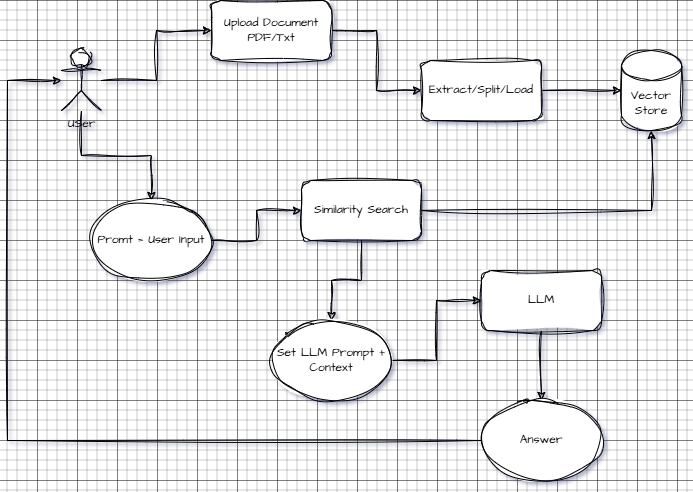

# Overview

This application is a prototype of Retrieval-Augmented Generation (RAG). It utilizes similarity search queries and a language model (LLM) to process 
and summarize responses based on the information retrieved through RAG.

### Status

- [X] Ongoing Development
- [ ] Ready for Testing
- [ ] Ready for Production

The diagram below defines the flow.



# Sample Response

Below is a sample response from a user's query.

```yaml
{
    "query": "show me a sample code related VanillaOption Header File?",
    "result": " Here is a sample of the `VanillaOption Header File` from the provided context, which declares the `VanillaOption` class:\n\n```cpp\n// VanillaOption Header File\n#ifndef VANILLOPTION_HPP\n#define VANILLOPTION_HPP\n\nclass VanillaOption {\npublic:\n    // Constructor and Destructor\n    VanillaOption(double strike, double timeToExpiry, const std::string& optionType);\n    virtual ~VanillaOption();\n\n    // Accessors and Mutators\n    double getStrike() const;\n    double getTimeToExpiry() const;\n    const std::string& getOptionType() const;\n\n    // Option price calculation methods (declared but not implemented in the header file)\n    virtual double calcCall() const = 0;\n    virtual double calcPut() const = 0;\n\nprivate:\n    double _strike;      // Strike Price\n    double _timeToExpiry; // Time to Expiry\n    std::string _optionType;   // Option Type (e.g., Call or Put)\n};\n\n#endif // VANILLOPTION_HPP\n```\n\nThis header file declares the `VanillaOption` class, which includes a constructor, destructor, accessors, and two pure virtual functions to calculate call and put option prices. These pure virtual functions are later implemented in derived classes like PayOffCall and PayOffPut.",
    "source": [
        {
            "source": "./resource/03 - C++ for Quantitative Finance.pdf",
            "page": 21
        },
        {
            "source": "./resource/03 - C++ for Quantitative Finance.pdf",
            "page": 243
        ,
        {
            "source": "./resource/03 - C++ for Quantitative Finance.pdf",
            "page": 20
        },
        {
            "source": "./resource/03 - C++ for Quantitative Finance.pdf",
            "page": 21
        }
    ]
}
```

# Vector Store

A vector store is a specialized database designed to store and manage data in the form of high-dimensional vectors, often used in machine learning, AI, 
and information retrieval systems. These vectors typically represent embeddings of text, images, audio, or other data, generated by models like neural 
networks. The goal of a vector store is to facilitate similarity searches and operations on these embeddings efficiently.

One key features is Similarity Search whereby if finds vectors that are most similar to a given query vector using metrics like cosine similarity, 
dot product, or Euclidean distance.

the application currently supports **Chroma** and **FAISS** vector store.

```dotenv
VECTOR_STORE__VECTOR_TYPE=faiss  # Options: "chroma", "faiss"
VECTOR_STORE__DATA_PATH=./db
VECTOR_STORE__RESOURCE_PATH=./docs
```
# Embeddings

Embeddings are numerical representations of data (like text, images, or audio) in a continuous vector space, where similar pieces of data are located closer together.

For example:

- In text embeddings, words, sentences, or documents with similar meanings will have embeddings that are close in the vector space.
- These embeddings are generated using pre-trained models (like those from HuggingFace, OpenAI, or Ollama) and are essential for tasks like 
  semantic search, recommendation systems, and question-answering.

```dotenv
EMBEDDINGS__EMBEDDING_MODEL=sentence-transformers/all-mpnet-base-v2
EMBEDDINGS__EMBEDDING_TYPE=huggingface # huggingface=HuggingFaceEmbeddings, openai=OpenAIEmbeddings, etc
EMBEDDINGS__DIMENSION=768 # check the embedding model dimension (not for chroma)
```

## Reference
1. OpenAI embeddings: https://platform.openai.com/docs/guides/embeddings
2. HuggingFace similarity embeddings:  https://huggingface.co/models?pipeline_tag=sentence-similarity


## Key Idea 
- Embeddings transform complex data into numbers that models and algorithms can easily understand and compare.

# Large Language Model (LLM)

A Large Language Model (LLM) is a type of artificial intelligence model trained on vast amounts of text data to understand and generate human-like language. 
It can process, interpret, and generate text based on the context it has learned. LLMs, like those from OpenAI, HuggingFace, or Ollama, are capable of a 
wide range of tasks, such as answering questions, summarizing text, translating languages, and even creating content. They work by predicting the next word 
in a sequence based on the patterns they’ve learned during training, making them powerful tools for natural language understanding and generation.

```dotenv
LLMS__LLM_TYPE=ollama # openai, huggingface, ollama (local llm server)
LLMS__TEMPERATURE=1.5
LLMS__LLM_NAME=mistral # this is ollama model
LLMS__API_KEY=api-key # openai or huggingface
LLMS__LOCAL_SERVER=http://localhost:11434 # for ollama local server only
```
## Recommended LLM

- HuggingFace: https://huggingface.co/models?pipeline_tag=summarization
- Ollama: https://github.com/ollama/ollama
- OpenAI: https://platform.openai.com/docs/models


# Requirement

## API Key

If using OpenAI or HuggingFace, make sure to register for API key on the website.
- OpenAI: https://platform.openai.com/docs/overview
- HuggingFace: https://huggingface.co/

## Ollama

The Ollama local server is a service that allows you to run and interact with Ollama's AI models locally on your machine, without needing to rely on 
remote cloud-based APIs. It enables you to deploy, query, and manage AI models directly on your local environment, providing faster response times and 
greater control over your data. The local server is particularly useful for running inference tasks like natural language processing, text generation, 
and other AI-driven tasks without the need for an internet connection.

Download the local server installer here: https://ollama.com/

Please note that it's recommended to install the local server on a machine with **GPU** processors for optimal performance.

- Memory: >= 16gb
- CPU: i7 or similar
- Storage: >= 20gb

Once installed, kindly refer to https://github.com/ollama/ollama on how to deploy a model such as **mistral** or **llama3.2**.

## Python

The application is running on **Python 3.12**

# Local Deployment

The below will guide you on the deployment steps. 

1. Install Python 3.12
2. Clone the repository
3. Install the required libraries (see *requirements.txt*)

## OpenAI / HuggingFace LLM

Set the environment variable

- OPENAI_API_KEY=\<OPENAI_API_KEY>
- HUGGINGFACEHUB_API_TOKEN=\<HUGGINGFACEHUB_API_TOKEN>

## Start the application

To launch the application locally, simply:

```commandline
python -m main.py
```

## OpenAPI Docs

Go to http://localhost:8000/docs


GhostScript - camelot dependency https://ghostscript.com/releases/gsdnld.html

